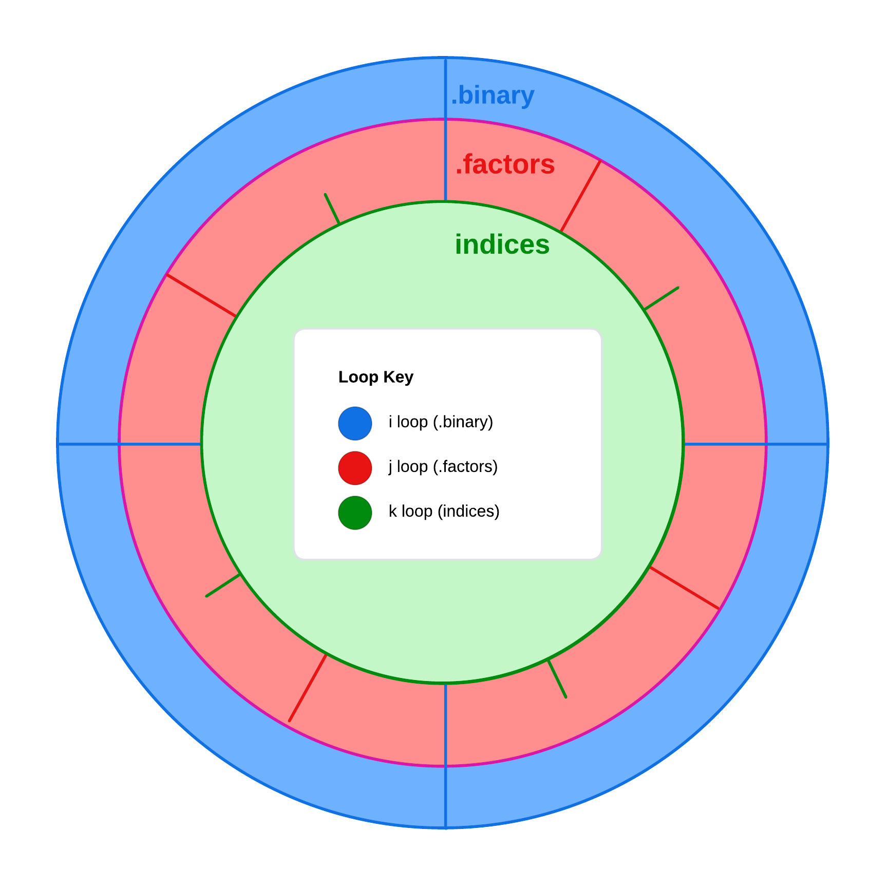

# __Sifters__
Sifters is a tool for developing musical compositions that makes use of combinatorial sieves as the point of departure for generative processes. My goal in coding Sifters has been to create a system for generating musical forms that are derived from a single logical source. The mechanism which hold that logic is called a 'sieve' and is a concept I inherited from my analysis of the score <i>Psappha</i> (1975) by Iannis Xenakis. The user is able to serialize the resulting intervalic structure by Prime, Inversion, Retrograde, and Retrograde-Inversion forms, as well as select from NonPitched, Monophonic, Homophonic, Heterophonic, and Polyphonic textures as contrapuntal representations of the sieve.

The application's functionality falls into one of three categories: generators, transformers, and controllers. Generators are designed to generate complete musical forms based on a generative sieve. Transformers are designed to apply probability based operations to generated musical textures. Controllers are designed to generate the inital input materials of a sieve.
# __Generators__


Generators are responsible for deriving compositional materials from a logical sieve. There are three main classes of Generators: Composition, Texture, and Score. Composition is the superclass of Texture and Score. Texture is the superclass of five additional classes: NonPitched, Monophonic, Homophonic, Heterophonic, and Polyphonic.

The Composition class is the superclass of all subsequent Generator classes. It holds methods for generating a serialized pitchclass matrix, as well as transforming a Pandas ```DataFrame```. These methods are shared and utilized by the Score and Texture classes.

The Texture class is responsible for generating baseline musical materials in the form of contrapuntal textures. These materials will go through a process of formalization within the Score class, and subject to further variations through Transformer classes.

The main function of the Score class is to combine specified textures into a single part, normalize the length of textures across all input arguments, and output a MIDI file based on the ```notes_data``` set in the Texture classes.
___
## class __Composition:__
The ```Composition``` class holds the code which is utilized by each of its subclasses: Score, and Texture. The primary function of the ```Composition``` class is to serve as a container of the most generic methods which will be utilized to formulate and reformulate a ```notes_data``` DataFrame within the Score and Texture classes.
___
### def __generate_pitchclass_matrix__(intervals):
The ```generate_pitchclass_matrix``` method generates a pitchclass matrix that has been modified to represent microtonal intervals in the form of a decimal point that falls inbetween pitchclasses. The method takes the input of a list of integers, calculates the delta between consecutive integers, and generates the rows and columns of a matrix by dividing the intervals by modulo 12.
___
### def __group_by_start__(dataframe):
The ```group_by_start``` method takes a ```notes_data``` DataFrame and groups all rows that share the same ```Start``` value. 
___
### def __get_lowest_midi__(dataframe):
The ```get_lowest_midi``` method is designed to find the lowest MIDI value from a ```notes_data``` DataFrame row with multiple MIDI values.
___
### def __check_and_close_intervals__(self, dataframe):
The ```check_and_close_intervals``` method looks at consecutive MIDI values and checks if the difference between values is greater than 6 (a tritone). If the delta between consecutive values is greater than 6 the method will lower or increase the current value by 12 depending on whether the approach is in a positive or negative direction. This is done by recursively calling the ```close_intervals``` helper method until all values have a delta of 6 or less.
___
### def __close_intervals__(dataframe):
The ```close_intervals``` method is a helper method of ```check_and_close_intervals``` which is called recursively on a ```notes_data``` DataFrame to ensure that all intervals between consecutive MIDI values are less than 6.
___
### def __adjust_midi_range__(dataframe):

___
### def __combine_consecutive_midi_values__(dataframe):

___
### def __convert_lists_to_scalar__(dataframe):

___
### def __parse_pitch_data__(dataframe):

___

## class __Texture__(Composition):
The ```Texture``` class holds methods which are shared by a number of subclasses. The subclasses are meant to replicate the behavior of contrapuntal musical textures. Each subclass adapts ```notes_data``` (generated in the ```Texture``` superclass) to the behavior characteristic of each contrapuntal texture. The behaviors replicated are ```Monophonic```, ```Homophonic```, ```Heterophonic```, and ```Polyphonic``` contrapuntal textures. There is also a ```NonPitched``` class which is meant to order nonpitched musical elements according to the same serial processes as the pitched textures.

The primary functionality of the ```Texture``` class is the ```set_notes_data``` method which generates the ```notes_data``` DataFrame. The ```set_notes_data``` method establishes the baseline MIDI data which will be further modified to approximate the behavior of a subclass. Upon initialization, a ```Texture``` object generates a list of binary numbers that represent a generative sieve. The length of the list is set by the periodicity between modulo of that sieve. Intervals are derived from the number of 0s between 1s and are mapped onto a musical octave. The musical octave is subdivided by the length of each binary list (which is equal to the periodicity of the sieve's moduli). In this way, the temperment of the piece is determined by the periodicity of each sieve.
___
### def __set_binary__(sieves):

___
### def __set_notes_data__():
The ```set_notes_data``` method is responsible for generating the base level MIDI ```notes_data``` DataFrame for each contrapuntal voice in the application. These voices are further processed by the ```Score``` class to ensure fidelity between voices.



This visualization shows how for every element belonging to the Texture object's ```self.binary``` attribute there is a corresponding iteration over the object's ```self.factors``` attributes. The method generates a part for each factor of ```len(self.binary[i])```. 

Each part is repeated a number of times that cooresponding to that part's durational value. The ratio of repititions is set by determining the factors of ```len(self.binary)```. Each factor is used to multiply the number of repititions as well as the length of that iteration's durational value.

<table style='margin:0 auto;'>
    <tr>
        <th>Repitition</th>
        <th>Duration</th>
    </tr>
    <tr>
        <td style='text-align:center;'>40</td>
        <td style='text-align:center;'>1</td>
    </tr>
    <tr>
        <td style='text-align:center;'>20</td>
        <td style='text-align:center;'>2</td>
    </tr>
    <tr>
        <td style='text-align:center;'>10</td>
        <td style='text-align:center;'>4</td>
    </tr>
    <tr>
        <td style='text-align:center;'>8</td>
        <td style='text-align:center;'>5</td>
    </tr>
    <tr>
        <td style='text-align:center;'>5</td>
        <td style='text-align:center;'>8</td>
    </tr>
    <tr>
        <td style='text-align:center;'>2</td>
        <td style='text-align:center;'>20</td>
    </tr>
    <tr>
        <td style='text-align:center;'>1</td>
        <td style='text-align:center;'>40</td>
    </tr>
</table>

Each row of this diagram represents a separate version of ```self.binary``` where the number of repititions cooresponds to the ``notes_data`` duration value. The ```set_notes_data``` method repeats the binary form for each factor of ```len(self.binary)```. The method also sets the durational value of each note so that the number of repititions and duration of each note equals the same length across versions of ```self.binary```.

In this way, ```set_notes_data``` combines each version of a single iteration over ```self.binary``` with every subsequent element of ```self.binary```. For each binary form there is a part that corresponds to each factor of ```len(self.binary)```. ```set_notes_data``` returns the combination of each part with each binary form, resulting in the total number of parts being equal to (number of factors) * (number of binary forms).

Generates a MIDI pool for a given sieve represented in ```self.binary```.

A MIDI pool is a set of pitches that can be used to generate a composition. This function generates a MIDI pool for a given sieve by computing the interval list for the sieve, creating a pitch matrix based on the intervals in the sieve, and generating all possible combinations of the rows and columns in the matrix. The resulting MIDI pool is a list of MIDI note values that can be used to generate a composition.

- Arguments: 
    - binary_index (int): Index representing the i loop from set_notes_data method. Iterates over binary form in self.binary.
    - factor_index (int): Index representing the j loop from set_notes_data method. Iterates over factor in self.factors.

- Returns: 
    - A list of MIDI values for the given sieve.

For each j iteration returns a list of midi values called ```midi_pool```. Each ```midi_pool``` contains the exact amount of midi information required for the k loop (which is equal to ```len(self.closed_intervals[binary_index]) * self.factors[factor_index]```).

The method derives a serial matrix from  ```self.closed_intervals[binary_index]```. The method then utilizes the helper method ```get_successive_diff``` to calculate the difference between successive intervals and appends that value to a list as either a positve or a negative integer.


In the example above we are given a list of steps which represent the successive differences in values of ```self.closed_intervals[binary_index]```. Ascending values between intervals are represented by a positive integer, and descending values between intervals are represented by a negative integer. This diagram displays the first two transformations of a midi sequence.

The first integer in this list is 7. Since 7 is a positive number the method traverses the rows 7 times, starting with the first row and preceeding down the rows of the matrix. If there are more steps then number of rows the pointer loops back to the first row of the matrix.

The second integer in this list is -4. Since -4 is a negative number the method traverses the columns 4 times, starting with the inversional pair of the last row of the previous transformation (in this case row B). The pointer then moves to the right 4 times to select the F column.

The ```generate_midi_pool``` method interprets positive integers as rows of the matrix, and negative numbers as columns. This is meant to associate ascending intervals with the prime form of the tone-row, and descending intervals with the inversional form of the tone-row.
___
## __class NonPitched(Texture):__
Initializes a NonPitched instrument with specified sieves, grid, MIDI mapping and form.
        
- Args:
    - sieves: A single sieve or a tuple of sieves representing the pitch content of the instrument.
    - grid: A Grid object representing the rhythmic content of the instrument (optional).
    - form: A Form object representing the formal structure of the instrument (optional).
___
## __class Monophonic(Texture):__

___
## __class Homophonic(Texture):__

___
## __class Heterophonic(Texture):__

___
## __class Polyphonic(Texture):__

___
## __class Score(Composition):__

___
### __def get_multiplier(arg):__

___
### __def normalize_numerator(arg, mult):__

___
### __def set_instrumentation(self):__

___
### __def normalize_periodicity(self):__

___
### __def write_score(self):__

___
### __def csv_to_note_object(dataframe):__

___
### __def csv_to_bend_object(dataframe):__

___
### __def combine_parts(self, *args):__
The ```combine_parts``` method is designed to combine multiple ```notes_data``` pandas DataFrames into a single ```notes_data``` DataFrame.
___
### __def get_max_end_value(dataframe):__

___
### __def update_end_value(dataframe):__

___
### __def expand_midi_lists(dataframe):__

___
### __def filter_first_match(dataframe):__

___
# Transformers

___
# Controllers

___
