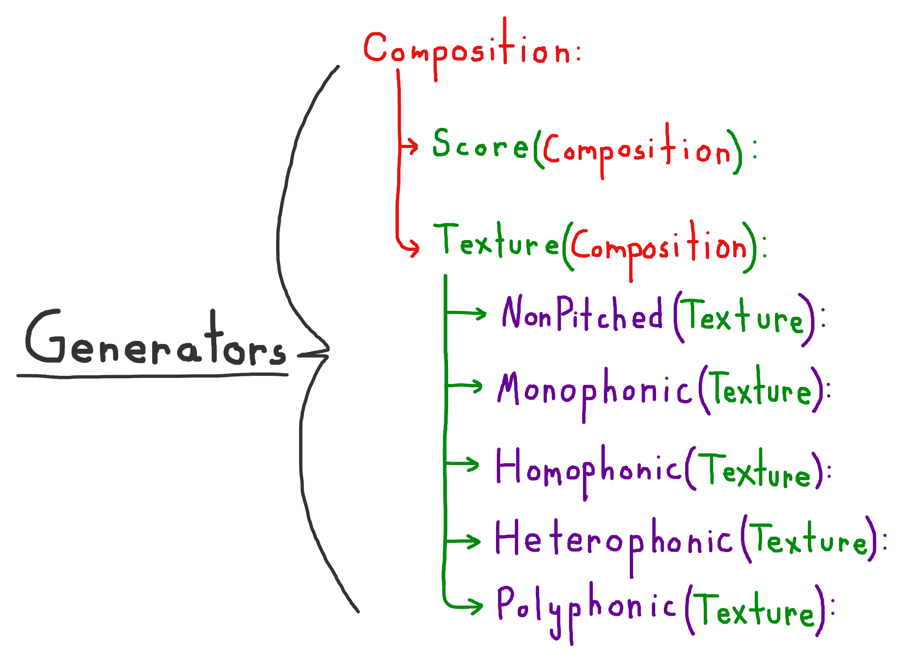
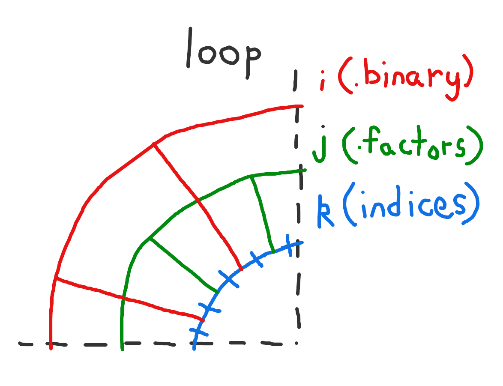
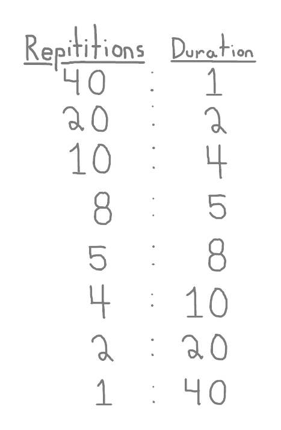
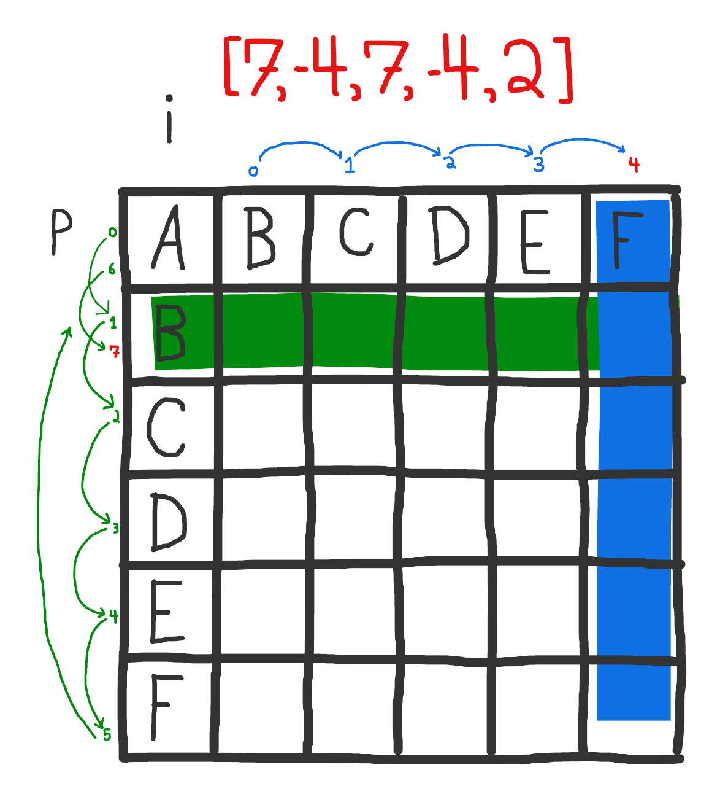

# Sifters
Sifters is a tool for developing musical compositions that makes use of combinatorial sieves as the point of departure for generative processes. My goal in coding Sifters has been to create a system for generating musical forms that are derived from a single logical source. The mechanism which hold that logic is called a 'sieve' and is a concept I inherited from my analysis of the score <i>Psappha</i> (1975) by Iannis Xenakis. The user is able to serialize the resulting intervalic structure by Prime, Inversion, Retrograde, and Retrograde-Inversion forms, as well as select from NonPitched, Monophonic, Homophonic, Heterophonic, and Polyphonic textures as a contrapuntal representation of the sieve.

The application's functionality falls into one of three categories: generators, transformers, and controllers. Generators are designed to generate complete musical forms based on a generative sieve. Transformers are designed to apply probability based operations to generated musical textures. Controllers are designed to generate the inital input materials of a sieve.
# Generators


Generators are responsible for deriving compositional materials from a logical sieve. There are three main classes of Generators: Composition, Texture, and Score. Composition is the superclass of Texture and Score. Texture is the superclass of five additional classes: NonPitched, Monophonic, Homophonic, Heterophonic, and Polyphonic.

The Composition class the superclass of all subsequent Generator classes. It holds methods for generating a serialized pitchclass matrix, as well as transforming a Pandas ```DataFrame```. These methods are shared and utilized by the Score and Texture classes.

The Texture class is responsible for generating baseline musical materials in the form of contrapuntal textures. These materials will go through a process of formalization within the Score class, and subject to further variations through Transformer classes.

The main function of the Score class is to combine specified textures into a single part, normalize the length of textures across all input arguments, and output a MIDI file based on the note data set in the Texture classes.
## class Composition:
### __def generate_pitchclass_matrix(intervals):__

### __def group_by_start(dataframe):__

### __def get_lowest_midi(dataframe):__

### __def check_and_close_intervals(self, dataframe):__

### __def close_intervals(dataframe):__

### __def adjust_midi_range(dataframe):__

### __def combine_consecutive_midi_values(dataframe):__

### __def convert_lists_to_scalar(dataframe):__
___

## class Texture(Composition):
### __def set_binary(self, sivs):__

### __def get_binary(self, sivs):__

### __def find_indices(self, binary_lists, target):__

### __def get_factors(num):__

### __def get_largest_prime_factor(self, num):__

### __def is_prime(num):__

### __def set_octave_interpolation(intervals):__

### __def segment_octave_by_period(period):__

### __def get_least_common_multiple(self, nums):__

### __def set_notes_data(self):__
Each binary list's form is repeated a number of times relative
to the duration of each grid unit for that repitition.

The ratio of repititions is set by determining the factors of ```len(self.binary)```.

Each factor is used to multiply the number of repitions as well as the length of that iteration's durational value.



This is a visualization shows how for every element belonging to the Texture object's ```self.binary``` attribute there is a corresponding iteration over the object's ```self.factors``` attributes.



Each row of this diagram represents a separate version of ```self.binary``` where the number of repititions cooresponds to the ``notes_data`` duration value. The ```set_notes_data``` method repeats the binary form for each factor of ```len(self.binary)```. The method also sets the durational value of each note so that the number of repititions and duration of each note equals the same length across versions of ```self.binary```.

In this way, ```set_notes_data``` combines each version of a single iteration over ```self.binary``` with every subsequent element of ```self.binary```. For each binary form there is a part that corresponds to each factor of ```len(self.binary)```. ```set_notes_data``` returns the combination of each part with each binary form, resulting in the total number of parts being equal to (number of factors) * (number of binary forms).
___
### __def generate_midi_pool(self, binary_index, factor_index):__

For each j iteration returns a list of midi values called ```midi_pool```. Each ```midi_pool``` contains the exact amount of midi information required for the k loop (which is equal to ```len(self.closed_intervals[binary_index]) * self.factors[factor_index]```).

The method generates a serial matrix off of ```self.closed_intervals[binary_index]```. The method then utilizes the helper method ```get_successive_diff``` to calculate the difference between successive intervals and appends that value to a list as either a positve or a negative integer.



In the example above we are given a list of steps which represent the successive differences in values of ```self.closed_intervals[binary_index]```. Ascending values between intervals are represented by a positive integer, and descending values between intervals are represented by a negative integer. This diagram displays the first two transformations of a midi sequence.

The first integer in this list is 7. Since 7 is a positive number the method traverses the rows 7 times, starting with the first row and preceeding down the rows of the matrix. If there are more steps then number of rows the pointer loops back to the first row of the matrix.

The second integer in this list is -4. Since -4 is a negative number the method traverses the columns 4 times, starting with the inversional pair of the last row of the previous transformation (in this case row B). The pointer then moves to the right 4 times to select the F column.

The ```generate_midi_pool``` method interprets positive integers as rows of the matrix, and negative numbers as columns. This is meant to associate ascending intervals with the prime form of the tone-row, and descending intervals with the inversional form of the tone-row.
## class NonPitched(Texture):
## class Monophonic(Texture):
## class Homophonic(Texture):
## class Heterophonic(Texture):
## class Polyphonic(Texture):

___
## class Score(Composition):

### __def get_multiplier(arg):__

### __def normalize_numerator(arg, mult):__

### __def set_instrumentation(self):__

### __def normalize_periodicity(self):__

### __def write_score(self):__

### __def csv_to_note_object(dataframe):__

### __def csv_to_bend_object(dataframe):__

### __def combine_parts(self, *args):__

### __def get_max_end_value(dataframe):__

### __def update_end_value(dataframe):__

### __def expand_midi_lists(dataframe):__

### __def filter_first_match(dataframe):__

# Transformers
# Controllers