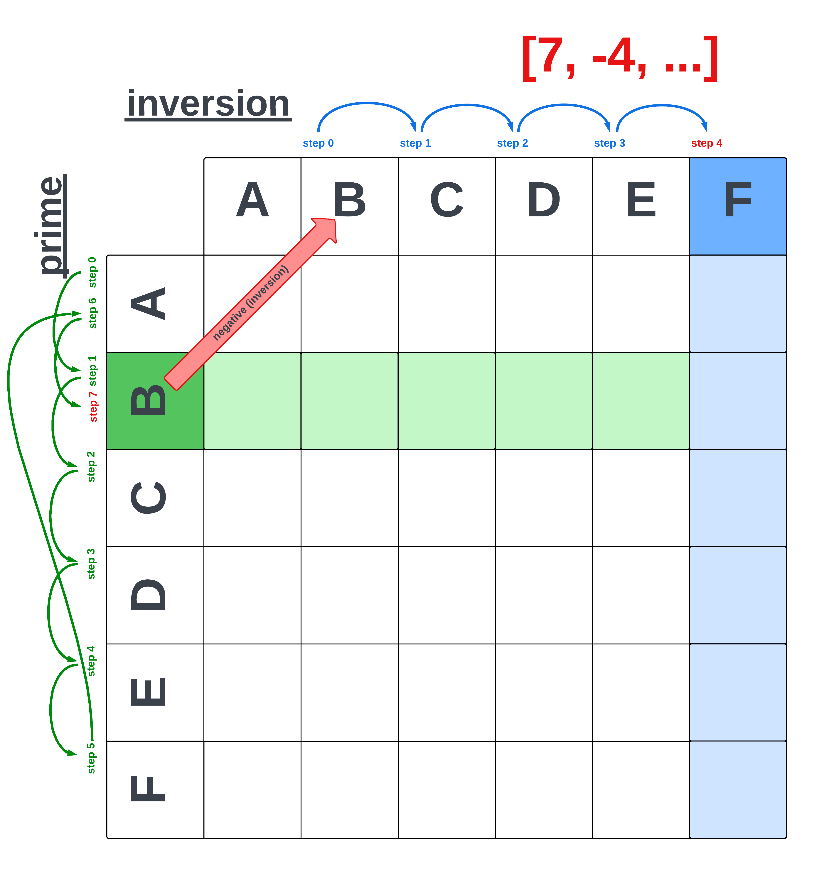

# __Sifters__
Sifters is a tool for developing musical compositions that makes use of logical sieves as the point of departure for creative processes. My goal in coding Sifters has been to create a system for generating musical forms that are derived from a single logical source. The mechanism which holds that logic is called a 'sieve' and is it's use to derive musical materials is a concept I inherited from my analysis of the score to <i>Psappha</i> (1975) by Iannis Xenakis.

The user is able to serialize the resulting intervalic structure by Prime, Inversion, Retrograde, and Retrograde-Inversion forms, as well as select from NonPitched, Monophonic, Homophonic, Heterophonic, and Polyphonic contrapuntal textures.

The application's functionality falls into one of three categories: Generators, Transformers, Controllers. Generators are designed to generate complete musical forms based on a generative sieve. Transformers are designed to apply probability based operations to generated musical textures. Controllers are designed to generate the inital input materials of a sieve.
# __Generators__
Generators are responsible for deriving compositional materials from a logical sieve. There are three main classes of Generators: Composition, Texture, and Score. Composition is the superclass of Texture and Score. Texture is the superclass of five additional classes: NonPitched, Monophonic, Homophonic, Heterophonic, and Polyphonic.

The Composition class is the superclass of all subsequent Generator classes. It holds methods for generating a serialized pitchclass matrix, as well as transforming a Pandas `DataFrame`. These methods are shared and utilized by the Score and Texture classes.

The Texture class is responsible for generating baseline musical materials in the form of contrapuntal textures. These materials will go through a process of formalization within the Score class, and subject to further variations through Transformer classes.

The main function of the Score class is to combine specified textures into a single part, normalize the length of textures across all input arguments, and output a MIDI file based on the `notes_data` set in the Texture classes.
___
## class __Composition:__
The `Composition` class holds the code which is utilized by each of its subclasses: Score, and Texture. The primary function of the `Composition` class is to serve as a container of the most generic methods which will be utilized to formulate and reformulate a `notes_data` DataFrame within the Score and Texture classes.
___
### def __generate_pitchclass_matrix__(intervals):
The `generate_pitchclass_matrix` method generates a pitchclass matrix that has been modified to represent microtonal intervals in the form of a decimal point that falls inbetween pitchclasses. The method takes the input of a list of integers, calculates the delta between consecutive integers, and generates the rows and columns of a matrix by dividing the intervals by modulo 12.
___
### def __group_by_start__(dataframe):
The `group_by_start` method takes a `notes_data` DataFrame and groups all rows that share the same `Start` value. 
___
### def __get_lowest_midi__(dataframe):
The `get_lowest_midi` method is designed to find the lowest MIDI value from a `notes_data` DataFrame row with multiple MIDI values.
___
### def __check_and_close_intervals__(self, dataframe):
The `check_and_close_intervals` method looks at consecutive MIDI values and checks if the difference between values is greater than 6 (a tritone). If the delta between consecutive values is greater than 6 the method will lower or increase the current value by 12 depending on whether the approach is in a positive or negative direction. This is done by recursively calling the `close_intervals` helper method until all values have a delta of 6 or less.
___
### def __close_intervals__(dataframe):
The `close_intervals` method is a helper method of `check_and_close_intervals` which is called recursively on a `notes_data` DataFrame to ensure that all intervals between consecutive MIDI values are less than 6.
___
### def __adjust_midi_range__(dataframe):

___
### def __combine_consecutive_midi_values__(dataframe):

___
### def __convert_lists_to_scalar__(dataframe):

___
### def __parse_pitch_data__(dataframe):

___
## __class Score(Composition):__

___
### __def get_multiplier(arg):__

___
### __def normalize_numerator(arg, mult):__

___
### __def set_instrumentation(self):__

___
### __def normalize_periodicity(self):__

___
### __def write_score(self):__

___
### __def csv_to_note_object(dataframe):__

___
### __def csv_to_bend_object(dataframe):__

___
### __def combine_parts(self, *args):__
The `combine_parts` method is designed to combine multiple `notes_data` pandas DataFrames into a single `notes_data` DataFrame.
___
### __def get_max_end_value(dataframe):__

___
### __def update_end_value(dataframe):__

___
### __def expand_midi_lists(dataframe):__

___
### __def filter_first_match(dataframe):__

___
## class __Texture__(Composition):
The role of the `Texture` class is to create a `notes_data` DataFrame to be passed down to a subclass to be modified to approximate the behavior of a musical contrapuntal texture. The primary functionality of the `Texture` class lies within the `set_notes_data()` method, which generates the `notes_data` DataFrame for a `Texture` object. The `notes_data` DataFrame establishes the baseline MIDI data which will be passed to a subclass. Each subclass adapts the `notes_data` DataFrame to the behavior characteristic of a musical contrapuntal texture. The behaviors replicated are `Monophonic`, `Homophonic`, `Heterophonic`, and `Polyphonic` contrapuntal textures. There is also a `NonPitched` class which is meant to order nonpitched musical elements according to the same serial processes as the pitched textures.

A `Texture` object accepts arguments for `sieves`, `grid`, and `form` values. The `sieves` value represents the generative logical sieve from which the `set_notes_data` method derives a musical structure. The `grid` value represents how the internal note duration of a single instance of a `Texture` object relates to the overall beat duration of the composition. The `form` value is a string input which sets the formal conditioning of the binary list that is passed to the `set_notes_data` method.

The default `grid` value for beat durations is `1/1` and cooresponds with a musically notated quarter note. A user is able to initialize a `Texture` object with any `grid` value given as a fraction relative to a quarter note. For examples, to initialize an instance of a `Texture` object with a `grid` value equal to 2 eighth note triplets, the user would pass `2/3` as the `grid` argument. A user is able to combine desired textures to create a single part with multiple `grid` values by using the `combine_parts` method from the `Score` class.

`Prime` is the default `form` value and indicates that the intervalic structure that is generated by `set_binary` will interpret it's generative sieve why assigning 1 to every index with an event, and 0 to every index without an event. `Inversion` will change the structure so that every index with an event will be assigned as 0, and every index without an event will be assigned 1. `Retrograde` and `Retrograde-Inversion` reverse `Prime` and `Inversion` forms respectively.

Upon initialization, a `Texture` object utilizes the `set_binary()` method to create a list of binary numbers that represent a given generative sieve. The length of the list is set by the periodicity between modulo of that sieve. Intervals are derived from the number of 0s between 1s and are mapped onto a musical octave. The musical octave is subdivided by the length of each binary list. Once all of these parameters have been set, the `set_notes_data` method is called, and a `notes_data` DataFrame is generated. The `notes_data` DataFrame is passed to a subclass to further modify its data to approxinate the behavior of a musical contrapuntal texture.
___
### <u>def __set_binary__(sieves):</u>

### <u>def __get_binary__(sieves):</u>

___
### <u>def __set_notes_data__():</u>

The `set_notes_data` method is responsible for generating the base level MIDI `notes_data` DataFrame for each contrapuntal voice in the application. At the core of the `set_notes_data` method is a ternary loop involving a `Texture` object's `self.binary`, `self.factors`, and the indices of non-zero elements present in the object's `self.binary` attribute. 

For every element belonging to the Texture object's `self.binary` attribute there is a corresponding iteration over that object's `self.factors` attributes. The method generates a part for each factor of `len(self.binary[i])`. Each part cycles through the non-zero indices of a `Texture` object's `self.binary` attribute to create a list of MIDI `notes_data`. The `notes_data` between parts differ by durational value and each part is repeated a number of times that cooresponding to that part's durational value. The ratio of repititions is set by determining the factors of `len(self.binary)`. Each factor is used to multiply the number of repititions as well as the length of that iteration's durational value. The parts are unified into a single `notes_data` DataFrame, now primed for to undergo further behavioral modification by the subclass which is calling the `set_notes_data` method.

<table style='margin:0 auto;'>
    <tr>
        <th>Repitition</th>
        <th>Duration</th>
    </tr>
    <tr>
        <td style='text-align:center;'>40</td>
        <td style='text-align:center;'>1</td>
    </tr>
    <tr>
        <td style='text-align:center;'>20</td>
        <td style='text-align:center;'>2</td>
    </tr>
    <tr>
        <td style='text-align:center;'>10</td>
        <td style='text-align:center;'>4</td>
    </tr>
    <tr>
        <td style='text-align:center;'>8</td>
        <td style='text-align:center;'>5</td>
    </tr>
    <tr>
        <td style='text-align:center;'>5</td>
        <td style='text-align:center;'>8</td>
    </tr>
    <tr>
        <td style='text-align:center;'>2</td>
        <td style='text-align:center;'>20</td>
    </tr>
    <tr>
        <td style='text-align:center;'>1</td>
        <td style='text-align:center;'>40</td>
    </tr>
</table>

Each row of this table represents a separate version of `self.binary` where the number of repititions cooresponds to the ``notes_data`` duration value. The `set_notes_data` method repeats the binary form for each factor of `len(self.binary)`. The method also sets the durational value of each note so that the number of repititions and duration of each note equals the same length across versions of `self.binary`.

In this way, `set_notes_data` combines each version of a single iteration over `self.binary` with every subsequent element of `self.binary`. For each binary form there is a part that corresponds to each factor of `len(self.binary)`. `set_notes_data` returns the combination of each part with each binary form, resulting in the total number of parts being equal to (number of factors) * (number of binary forms).

### <u>def __generate_midi_pool__(binary_index, factor_index):</u>

The `generate_midi_pool` method derives a MIDI pool from a binary list. A MIDI pool is a set of pitches that can be used to generate a composition. This function generates a MIDI pool for a given sieve by computing the interval list for the sieve, creating a pitch matrix based on the intervals in the sieve, and generating all possible combinations of the rows and columns in the matrix. The resulting MIDI pool is a list of MIDI note values that can be used to generate a composition.

The above diagram illustrates how an interval structure will dictate row selection from a pitchclass matrix. Here we see how `genereate_midi_pool` will approach the first two movements in a pitchset of `[7, -4, 7, -4, 2]`. Ascending values between intervals are represented by a positive integer, and descending values between intervals are represented by a negative integer. The method computes the number of tone-rows needed and iterates over the matrix to derive rows as needed. Once a row is selected it is appended to a list of notes data called `midi_pool`. The purpose of `midi_pool` is to provide the MIDI note value for the construction of a `notes_data` DataFrame by the `set_notes_data` method. 

The first integer in this list is 7. Since 7 is a positive number the method traverses the rows 7 times, starting with the first row and preceeding down the rows of the matrix. If there are more steps then number of rows the pointer loops back to the first row of the matrix.

The second integer in this list is -4. Since -4 is a negative number the method traverses the columns 4 times, starting with the inversional pair of the last row of the previous transformation (in this case row B). The pointer then moves to the right 4 times to select the F column.

Positive integers are intrepreted as rows of the matrix, and negative numbers as columns. This is meant to associate ascending intervals with the prime form of the tone-row, and descending intervals with the inversional form of the tone-row. If the number of movements from the current position exceeds the remaining spaces of the matrix, the position will cycle to the beginning of the matrix. Every time there is a cycling of the matrix a boolean value called `Retrograde` is updated. If `Retrograde == True` then the selected row will be appended to the `midi_pool` list in ther reverse order. All subsequent rows will be appended to the `midi_pool` list in retrograde form until there is another cycling of the matrix, at which point the `Retrograde` value will revert to `False`.

### <u>def __get_successive_diff__(lst):</u>

### <u>def __segment_octave_by_period__(period):</u>

### <u>def __generate_pitchclass_matrix__(intervals):</u>
___
## __class Monophonic(Texture):__
The `Monophonic` class is the least complex musical texture and is characterized by single part voice leading. Upon initialization, the `Monophonic` class intreprets a `notes_data` DataFrame and transforms its values to create a melody. This processes of transformation occurs over the course of several steps. 

<table style='margin:0 auto;'>
<caption style="font-size: 18px;text-decoration: underline;"><b>group_by_start</b>(dataframe):</caption>
    <tr>
        <th>MIDI</th>
        <th>Start</th>
        <th>End</th>
    </tr>
    <tr>
        <td>[41.0]</td>
        <td>13.0</td>
        <td>[14.0]</td>
    </tr>
    <tr>
        <td>[41.3]</td>
        <td>14.0</td>
        <td>[15.0]</td>
    </tr>
    <tr>
        <td>[43.0]</td>
        <td>15.0</td>
        <td>[16.0]</td>
    </tr>
    <tr>
        <td>"[43.1, 44.0, 45.5]"</td>
        <td>16.0</td>
        <td>[17.0]</td>
    </tr>
    <tr>
        <td>[45.0]</td>
        <td>17.0</td>
        <td>[18.0]</td>
    </tr>
    <tr>
        <td>[47.8]</td>
        <td>19.0</td>
        <td>[20.0]</td>
    </tr>
        <tr>
        <td>"[41.0, 43.0, 44.0, 48.8]"</td>
        <td>19.0</td>
        <td>[20.0]</td>
    </tr>
        <tr>
        <td>"[43.7, 45.4]"</td>
        <td>19.0</td>
        <td>[20.0]</td>
    </tr>
</table>

1) Group all the DataFrame rows that share the same `'Start'` value by using the `group_by_start` method. The resulting DataFrame will group all `'MIDI'` values that share the same `'Start'` value. In musical terms, `'MIDI'` note values that share the same `'Start'` value are commonly referred to as a 'chord'. 

<table style='margin:0 auto;'>
<caption style="font-size: 18px;text-decoration: underline;"><b>get_lowest_midi</b>(dataframe):</caption>
    <tr>
        <th>MIDI</th>
        <th>Start</th>
        <th>End</th>
    </tr>
    <tr>
        <td>41.0</td>
        <td>13.0</td>
        <td>[14.0]</td>
    </tr>
    <tr>
        <td>41.3</td>
        <td>14.0</td>
        <td>[15.0]</td>
    </tr>
    <tr>
        <td>43.0</td>
        <td>15.0</td>
        <td>[16.0]</td>
    </tr>
    <tr>
        <td>43.1</td>
        <td>16.0</td>
        <td>[17.0]</td>
    </tr>
    <tr>
        <td>45.0</td>
        <td>17.0</td>
        <td>[18.0]</td>
    </tr>
    <tr>
        <td>47.8</td>
        <td>19.0</td>
        <td>[20.0]</td>
    </tr>
    <tr>
        <td>41.0</td>
        <td>19.0</td>
        <td>[20.0]</td>
    </tr>
    <tr>
        <td>43.7</td>
        <td>19.0</td>
        <td>[20.0]</td>
    </tr>
</table>

2) Call the `get_lowest_midi` method to transform the DataFrame so that only the lowest `'MIDI'` value remains in instances where multiple `'MIDI'` values share the same `'Start'` value. From this point forward the DataFrame is representing a monophonic musical texture.

<table style='margin:0 auto;'>
<caption style="font-size: 16px;text-decoration: underline;"><b>close_intervals</b>(dataframe):</caption>
    <tr>
        <th>MIDI</th>
        <th>Start</th>
        <th>End</th>
    </tr>
    <tr>
        <td>41.0</td>
        <td>13.0</td>
        <td>[14.0]</td>
    </tr>
    <tr>
        <td>41.3</td>
        <td>14.0</td>
        <td>[15.0]</td>
    </tr>
    <tr>
        <td>43.0</td>
        <td>15.0</td>
        <td>[16.0]</td>
    </tr>
    <tr>
        <td>43.1</td>
        <td>16.0</td>
        <td>[17.0]</td>
    </tr>
    <tr>
        <td>45.0</td>
        <td>17.0</td>
        <td>[18.0]</td>
    </tr>
    <tr>
        <td>47.8</td>
        <td>19.0</td>
        <td>[20.0]</td>
    </tr>
    <tr>
        <td>53.0</td>
        <td>17.0</td>
        <td>[18.0]</td>
    </tr>
    <tr>
        <td>59.6</td>
        <td>19.0</td>
        <td>[20.0]</td>
    </tr>
</table>

3) Call the `close_intervals` method to transform the DataFrame to avoid intervals between successive `'MIDI'` values that are greater than 6 (a tritone). If the delta between successive notes is greater than 6 than the current `'MIDI'` value is transposed by 12 (an octave). The purpose of calling this method is to find the smallest possible distance between successive pitches in order to ensure the smoothest possible voiceleading. The method is called recursively until there are no intervals greater than 6.

<table style='margin:0 auto;'>
<caption style="font-size: 18px;text-decoration: underline;"><b>combine_consecutive_midi_values</b>(dataframe):</caption>
    <tr>
        <th>MIDI</th>
        <th>Start</th>
        <th>End</th>
    </tr>
    <tr>
        <td>41.0</td>
        <td>13.0</td>
        <td>[14.0]</td>
    </tr>
    <tr>
        <td>41.3</td>
        <td>14.0</td>
        <td>[15.0]</td>
    </tr>
    <tr>
        <td>43.0</td>
        <td>15.0</td>
        <td>[16.0]</td>
    </tr>
    <tr>
        <td>43.1</td>
        <td>16.0</td>
        <td>[17.0]</td>
    </tr>
    <tr>
        <td>45.0</td>
        <td>17.0</td>
        <td>[18.0]</td>
    </tr>
        <tr>
        <td>47.8</td>
        <td>19.0</td>
        <td>[20.0]</td>
    </tr>
    <tr>
        <td>53.0</td>
        <td>20.0</td>
        <td>[21.0]</td>
    </tr>
    <tr>
        <td>55.7</td>
        <td>22.0</td>
        <td>[23.0]</td>
    </tr>
</table>

4) Utilize the `combine_consecutive_midi_values` method to find consecutive rows that share the same `'MIDI'` value. The method changes the `'End'` value of the first in the consecutive rows to the `'End'` value from the last row of the range of shared `'MIDI'` values. The method then deletes all rows except for the first row in the range of consecutive `'MIDI'`, and in this way combines all rows with consecutive `'MIDI'` values.

<table style='margin:0 auto;'>
<caption style="font-size: 18px;text-decoration: underline;"><b>convert_list_to_scalars</b>(dataframe):</caption>
    <tr>
        <th>MIDI</th>
        <th>Start</th>
        <th>End</th>
    </tr>
    <tr>
        <td>41.0</td>
        <td>13.0</td>
        <td>14.0</td>
    </tr>
    <tr>
        <td>41.3</td>
        <td>14.0</td>
        <td>15.0</td>
    </tr>
    <tr>
        <td>43.0</td>
        <td>15.0</td>
        <td>16.0</td>
    </tr>
    <tr>
        <td>43.1</td>
        <td>16.0</td>
        <td>17.0</td>
    </tr>
    <tr>
        <td>45.0</td>
        <td>17.0</td>
        <td>18.0</td>
    </tr>
        <tr>
        <td>47.8</td>
        <td>19.0</td>
        <td>20.0</td>
    </tr>
    <tr>
        <td>53.0</td>
        <td>20.0</td>
        <td>21.0</td>
    </tr>
    <tr>
        <td>55.7</td>
        <td>22.0</td>
        <td>23.0</td>
    </tr>
</table>

5) Utilize the `convert_lists_to_scalars` method

<table style='margin:0 auto;'>
<caption style="font-size: 18px;text-decoration: underline;"><b>parse_pitch_data</b>(dataframe):</caption>
    <tr>
        <th>MIDI</th>
        <th>Pitch</th>
        <th>Start</th>
        <th>End</th>
    </tr>
    <tr>
        <td>41.0</td>
        <td>0.0</td>
        <td>13.0</td>
        <td>14.0</td>
    </tr>
    <tr>
        <td>41.0</td>
        <td>0.3</td>
        <td>14.0</td>
        <td>15.0</td>
    </tr>
    <tr>
        <td>43.0</td>
        <td>0.0</td>
        <td>15.0</td>
        <td>16.0</td>
    </tr>
    <tr>
        <td>43.0</td>
        <td>0.1</td>
        <td>16.0</td>
        <td>17.0</td>
    </tr>
    <tr>
        <td>45.0</td>
        <td>0.0</td>
        <td>17.0</td>
        <td>18.0</td>
    </tr>
        <tr>
        <td>47.0</td>
        <td>0.8</td>
        <td>19.0</td>
        <td>20.0</td>
    </tr>
    <tr>
        <td>53.0</td>
        <td>0.0</td>
        <td>20.0</td>
        <td>21.0</td>
    </tr>
    <tr>
        <td>55.0</td>
        <td>0.7</td>
        <td>22.0</td>
        <td>23.0</td>
    </tr>
</table>

6) Call the `parse_pitch_data` method

This way we have all In turn, the transfromed DataFrame-- now representing a melody-- is passed to the `Homophonic`, `Heterophonic`, and `Polyphonic` classes as the basis for further contrapuntal development 
___
## __class Homophonic(Texture):__

___
## __class Heterophonic(Texture):__

___
## __class Polyphonic(Texture):__

___
## __class NonPitched(Texture):__

___
# Transformers

___
# Controllers

___
